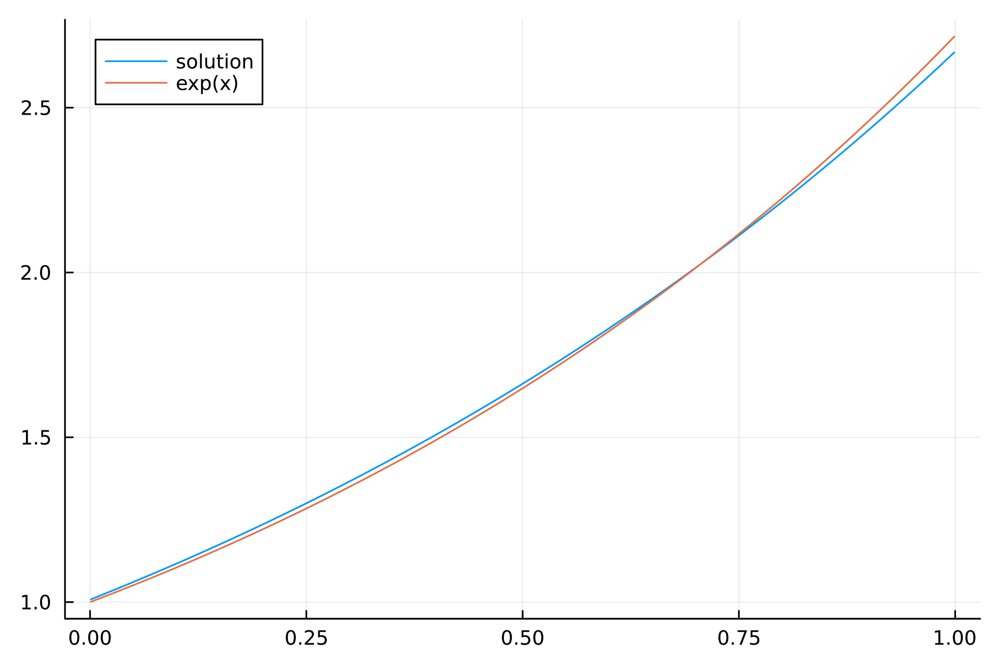
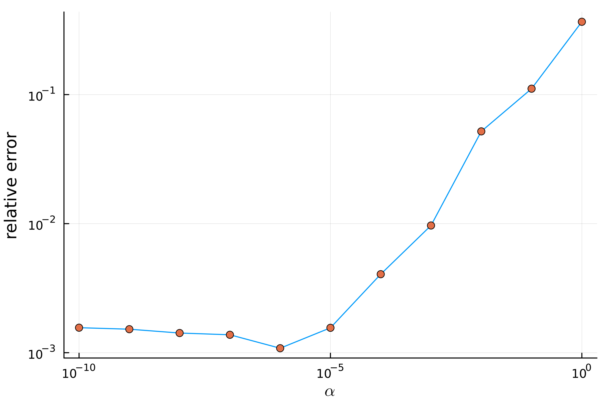

# 第一类积分方程的并行 LU 求解

## 问题描述

本文旨在求解以下第一类积分方程:

$$
\int_{0}^{1} \mathrm{e}^{ts} x(s) \ ds = y(t) = \frac{\mathrm{e}^{t +1} - 1}{t+1},\quad 0\leq t\leq 1.
$$

该方程的精确解为 $x(t) = \mathrm{e}^{t}$.

## 算法描述

采用步长 $h = 1 / n$, 利用复合梯形公式离散化左端积分:

$$
\int_{0}^{1} \mathrm{e}^{ts}x(s)\ ds \approx h\left(\frac{1}{2} x(0) + \frac{1}{2} \mathrm{e}^{t}x(1) + \sum_{j = 1}^{n-1} \mathrm{e}^{jht} x(jh)\right).
$$

对于不同的等分区间数 $n$, 通过求解以下线性代数方程组来近似 $x(ih)$ 的值:

$$
  h\left(\frac{1}{2} x(0) + \frac{1}{2} \mathrm{e}^{ih} x(1) + \sum_{j = 1}^{n-1}\mathrm{e}^{jh*ih}x(jh)\right) = y(ih),\quad i = 0,1,\dots,n.
$$

由于离散化后的线性方程组 $Kx = y$ 存在不适定性（矩阵 $K$ 随 $n$ 增大而求逆不稳定）, 通常采用正则化方法进行求解, 即求解以下方程:

$$
  \left(\alpha I + K^{\top}K\right) x_{\alpha} = K^{\top}y.
$$

其中 $x_{\alpha}$ 作为 $x$ 的近似解, $\alpha$ 为一预设小参数.

### 并行 LU 分解算法

本研究采用并行 LU 分解算法求解上述方程组, 具体算法流程如下图所示:

## 数值结果

首先, 设置参数 $n = 1000$ 和 $\alpha = 10^{-3}$ 进行求解. 数值结果与精确解的对比图如下所示:

从图中可以看出, 数值解与精确解 $\mathrm{e}^t$ 吻合良好.
其次, 我们考察正则化参数 $\alpha$ 对求解精度的影响, 结果如下图所示:

结果表明, 随着 $\alpha$ 的减小, 解的相对误差随之降低. 然而, 当 $\alpha$ 减小到 $10^{-6}$ 后, 解的精度不再显著提高. 这可能是由于此时矩阵条件数增大, 问题适定性变差, 导致 LU 分解的精度不足.

最后, 我们将本文所用并行 LU 分解算法与 Eigen 库中的并行 LU 分解算法进行性能对比. 两种算法的平均运行时间（10次运行）如下:

| 求解器类型          | 平均运行时间 (ms) |
| :------------------ | :---------------- |
| Eigen LLT Solver    | 34.6713           |
| Parallel LU Solver | 33.7442           |
